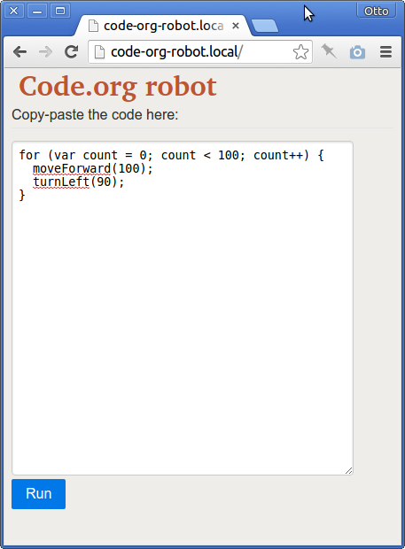

# A robot that executes the Code.org code #


## Hardware setup ##

 * Buy the [Ryantek RTK-000-003 Budget Robotics Kit](https://ryanteck.uk/raspberry-pi/45-ryanteck-budget-robotics-kit-for-raspberry-pi-620979161726.html) with the wifi module and assemble it
 * Also needed: as Raspberry Pi computer, a USB battery to run the Raspi wirelessly and 4 AAA sized batteries to power the wheels

For the setup stage you also need to connect the robot via HDMI to a monitor, via USB to a keyboard and via Ethernet cable to the Internet. Finally start the system by connecting power via USB.

## Software setup - quick method ##

Download ready made image:

```
wget http://koodikerho.fi/code-org-robot/code-org-robot.img.xz
```

Extract and load to the SD card (in example below SD card is at address /dev/sdb)

```
unzx code-org-robot.img.xz
sudo dd if=code-org-robot.img. of=/dev/sdb
```

## Software setup - most educating method ##

Install the latest Rasbian as the operating system. Activate SSH and log in remotely so you can copy-paste the commands below from the comfort of you laptop or work station.

### Wifi access point setup ###

In stand alone robot mode there must be some way to wirelessly communicate to the robot. The most usable solution is to make the robot a wireless access point that its operator can connect to.

Follow instructions at http://seravo.fi/2014/create-wireless-access-point-hostapd to put the wifi module in master mode and provide a wifi access point. Make the SSID 'Robot' so it's easy to recognize the network. Use your laptop to connect to that wifi network and confirm it works by SSH'ing in to the Raspberry Pi computer.

First install the required software:

```
sudo apt-get update
sudo apt-get install hostapd dnsmasq
```

Then configure the access point:
```
/etc/network/interfaces

  # Please note that this file is written to be used with dhcpcd.
  # For static IP, consult /etc/dhcpcd.conf and 'man dhcpcd.conf'.

  auto lo
  iface lo inet loopback

  auto eth0
  allow-hotplug eth0
  iface eth0 inet manual

  #auto wlan0
  #allow-hotplug wlan0
  #iface wlan0 inet manual
  #wpa-conf /etc/wpa_supplicant/wpa_supplicant.conf

  #auto wlan1
  #allow-hotplug wlan1
  #iface wlan1 inet manual
  #wpa-conf /etc/wpa_supplicant/wpa_supplicant.conf

  # RPi as a Wireless access point
  auto wlan0
  iface wlan0 inet static
  hostapd /etc/hostapd/hostapd.conf
  address 192.168.0.1
  netmask 255.255.255.0
```


```
/etc/hostapd/hostapd.conf
  interface=wlan0
  ssid=Code.org-robot
  hw_mode=g
  auth_algs=1
```

```
/etc/dnsmasq.conf
  interface=lo,wlan0
  no-dhcp-interface=lo
  dhcp-range=192.168.0.50,192.168.0.150,12h
```

```
/etc/sysctl.conf
  net.ipv4.ip_forward=1
```

```
/etc/rc.local
  iptables -t nat -A POSTROUTING -s 192.168.0.0/24 ! -d 192.168.0.0/24  -j MASQUERADE

chmod +x /etc/rc.local
```


### Node.js installation ###

First install 0.10 on newer version of Raspbian-compatible of Node.js. On Rasbian 8.0 (Debian Jessie) Node.js 0.10 is in the official repositories directly:

```
apt-get install nodejs npm
cd /usr/local/bin
sudo ln -s /usr/bin/nodejs node
sudo npm install -g forever
```

### Server installation ###

Second step is to install this Node.js app and run it:

```
git clone https://github.com/ottok/code-org-robot.git
cd code-org-robot
npm install
sudo nodemon robot.js
```

Super user priviledges are needed so that the [Cylon robotics library](http://cylonjs.com/documentation/platforms/raspberry-pi/) can access the GPIO pin controls.

### Run automatically on restart ###

To have the robot running automatically on boot, you need in /etc/rc.local to define and export PATH and NODE_PATH, change directory into the code-org-robot directory and launch the server.js via [forever](https://github.com/foreverjs/forever).

Add to /etc/rc.local:

```
# Start server
export PATH=/usr/local/sbin:/usr/local/bin:/usr/sbin:/usr/bin:/sbin:/bin:/usr/local/games:/usr/games
export NODE_PATH=/usr/lib/nodejs:/usr/lib/node_modules:/usr/share/javascript
cd /home/pi/code-org-robot
forever server.js &
```


## Running the robot ##

Once the robot is running, the operator can join the robot WLAN. Once connected, the operator should make sure the Node.js app is running and the web UI is visible. After that, simply copy-paste any code from Code.org and run it!




Printable instructions at in Finnish at https://github.com/ottok/code-org-robot/raw/master/instructions/Finnish.odt

Contributions to translate it is welcomed!


## Howto calibrate the turning circle ##

By default the robot.js assumes that it takes 1.52 seconds for the motors to rotate the robot a full 360 degrees circle:

```
var circleTime = 1.52;
```

Depending on differences in hardware, this figure may vary. Many Raspberry Pi A+ -models seem to do a full circle in 1.05 seconds. Experiment by changing the variable and restarting the program to find your optimal value.


## TODO ##

 # Integrate a small IDE in the web UI to make writing more code pleasant
 # Run eval() on the code already on the browser side and thus protect from failures in the eval() execution on the server side (as client side failure is easier for user to detect and debug than server)
 # Make server-client communication more real time, maybe provide a websocket based console that exposes in web ui what the server ran
 # Write more JavaScript functions to extend the compatibility with all possible function names used at Code.org
 # Better calibrate the robot's wheels to ensure clean 90 degree turns

